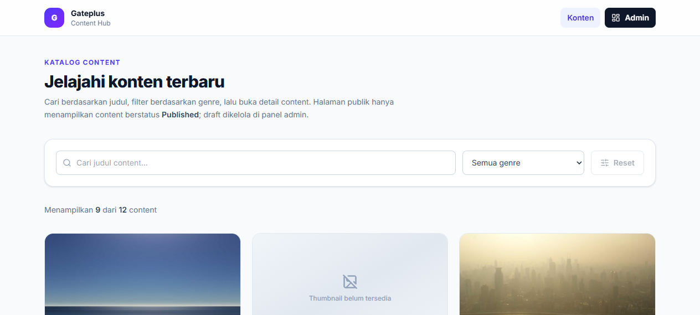
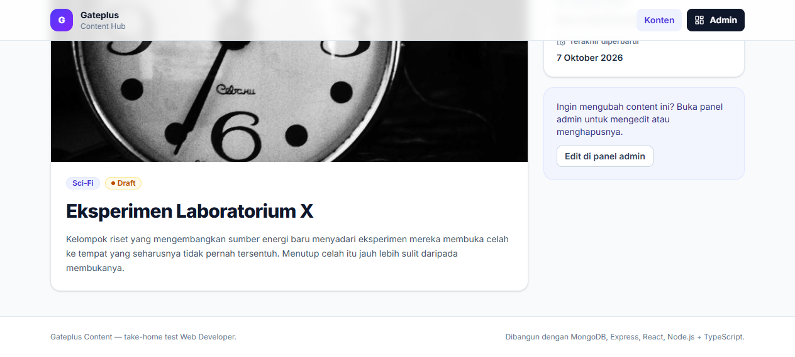
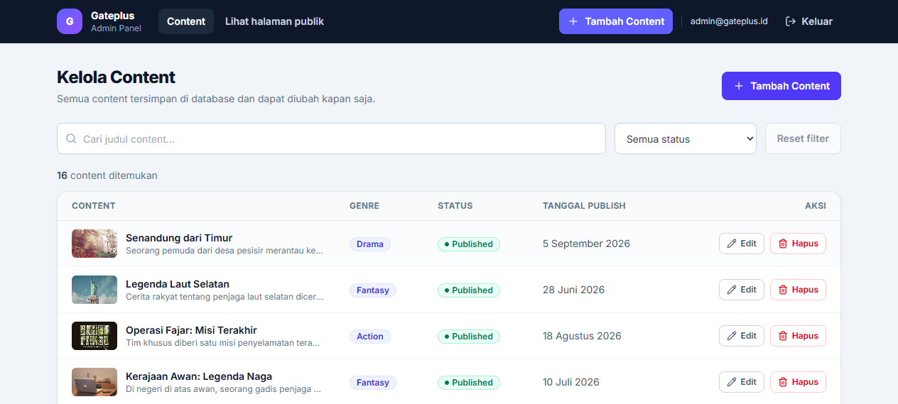
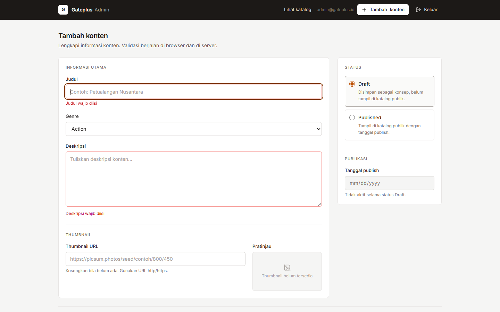
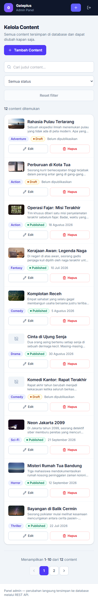
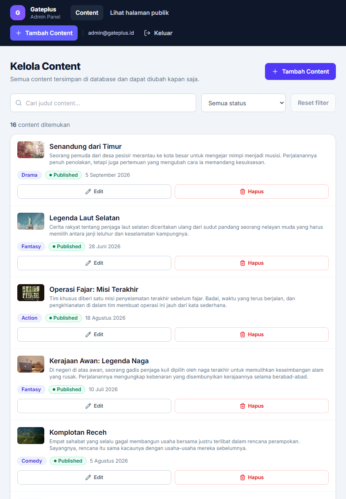
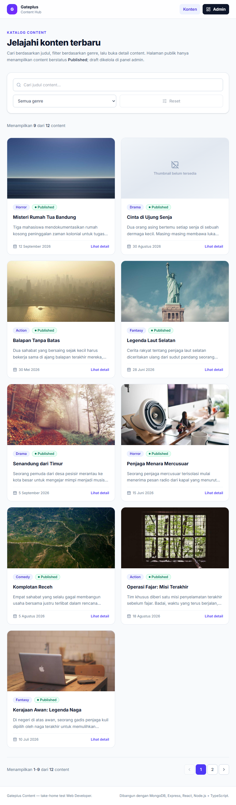

# Gateplus Content Management

[](https://github.com/JakaxKato/gateplus-content-management/actions/workflows/ci.yml)

Aplikasi pengelolaan konten dengan dua sisi: halaman publik untuk membaca konten, dan panel admin untuk membuat, mengubah, serta menghapusnya. Semua data mengalir lewat REST API ke MongoDB.

---

**Nama:** Jaka Kelana Wijaya
**Repository:** https://github.com/JakaxKato/gateplus-content-management
**Live Demo:** https://gateplus-content-management.vercel.app
**API produksi:** https://gateplus-content-management.onrender.com/api
**Catatan:** Kredensial demo admin ada di bagian [Demo Credentials](#demo-credentials).

---

## Deskripsi Aplikasi

Alur yang dibangun: **User → Frontend → API/Backend → Database → API Response → Frontend**.

- **Halaman publik** (`/contents`). Daftar konten dengan thumbnail (atau placeholder), genre, deskripsi singkat, status, dan tanggal publish. Ada pencarian judul, filter genre, pagination, dan halaman detail. State loading (skeleton), empty, error, dan tombol retry tersedia. Halaman ini hanya menampilkan konten berstatus `published`.
- **Panel admin** (`/admin`). Login, daftar seluruh konten termasuk draft (tabel di desktop, card di mobile), create, update, dan delete dengan dialog konfirmasi. Validasi berjalan di frontend dan backend.
- **REST API** (`/api`). CRUD konten dengan status code yang sesuai, format response seragam, error handling terpusat, dan validasi di sisi server.

### Tampilan aplikasi

| Halaman publik | Detail konten |
| --- | --- |
|  |  |

| Panel admin | Validasi form |
| --- | --- |
|  |  |

Panel admin memakai card di layar kecil dan tabel di desktop:

| Mobile (390px) | Tablet (820px) |
| --- | --- |
|  |  |

| Tablet, halaman publik |
| --- |
|  |

## Tech Stack

MERN + TypeScript di kedua sisi:

| Bagian | Teknologi |
| --- | --- |
| Database | MongoDB 7 (via Docker Compose) + Mongoose 9 |
| Backend | Node.js 24, Express 5, TypeScript, Zod, JWT + bcryptjs, helmet, express-rate-limit |
| Frontend | React 19, Vite, TypeScript, Tailwind CSS v4, React Router 7 |
| Data fetching | TanStack Query v5, fetch API bawaan |
| Form | React Hook Form + Zod resolver |
| Testing & quality | Vitest + Supertest (32 API test), ESLint, `tsc --noEmit`, GitHub Actions |

## Cara Menjalankan Project

Prasyarat: Node.js 20+ (dites di Node 24, lihat `.nvmrc`), npm, dan Docker untuk MongoDB. Bisa juga memakai MongoDB Atlas dengan mengganti `MONGODB_URI`.

```bash
# 0. opsional, pakai versi Node yang disarankan
nvm use

# 1. install dependency root, server, dan client
npm run install:all

# 2. siapkan environment server
#    Windows:  copy server\.env.example server\.env
#    macOS/Linux:
cp server/.env.example server/.env
#    lalu isi JWT_SECRET dengan string acak yang panjang

# 3. jalankan MongoDB
npm run db:up

# 4. isi database dengan 16 konten dan 1 akun admin
npm run seed

# 5. jalankan API dan frontend sekaligus
npm run dev
```

Setelah itu:

| Layanan | URL |
| --- | --- |
| Halaman publik | http://localhost:5173/contents |
| Panel admin | http://localhost:5173/admin/login |
| REST API | http://localhost:5000/api/health |

Script lain yang tersedia:

```bash
npm run lint        # ESLint untuk server + client
npm run typecheck   # TypeScript check untuk server + client
npm test            # 32 automated test API (butuh MongoDB berjalan)
npm run build       # build production server + client
npm run check       # lint + typecheck + test + build sekaligus
npm run db:down     # hentikan container MongoDB
```

> **Kalau install terasa aneh:** sebagian mesin menetapkan `NODE_ENV=production` secara global, dan npm akan melewati devDependencies (ESLint, Vitest, TypeScript). Pakai `npm install --include=dev` di folder `server/` dan `client/`. Script `npm run install:all` sudah memakai flag itu.

## Deploy (Opsional)

Aplikasi yang berjalan sekarang memakai Vercel untuk frontend, Render untuk backend, dan MongoDB Atlas untuk database. Berikut langkah mengulanginya dari nol.

### 1. Database: MongoDB Atlas (cluster M0 gratis)

1. Buat cluster M0 dan satu database user.
2. Di Network Access, izinkan `0.0.0.0/0` karena Render memakai IP keluar yang dinamis.
3. Salin connection string, lalu tambahkan nama database: `mongodb+srv://…/gateplus`.

### 2. Backend: Render (Web Service)

| Pengaturan | Nilai |
| --- | --- |
| Root Directory | `server` |
| Build Command | `npm ci --include=dev && npm run build` |
| Start Command | `npm start` |
| Health Check Path | `/api/health` |

Environment variables: `NODE_ENV=production`, `MONGODB_URI=<connection string Atlas>`, `JWT_SECRET=<string acak panjang>`, `JWT_EXPIRES_IN=7d`, dan `CLIENT_ORIGIN=https://<app>.vercel.app`. Beberapa origin boleh dipisah koma, misalnya untuk preview deployment.

> `--include=dev` jangan dihapus dari build command. Render menyetel `NODE_ENV=production`, dan pada kondisi itu `npm install` melewati devDependencies. TypeScript tidak ikut terpasang dan build gagal.

> Free tier Render tidur setelah sekitar 15 menit idle, jadi request pertama bisa terasa lambat.

### 3. Frontend: Vercel

| Pengaturan | Nilai |
| --- | --- |
| Root Directory | `client` (framework terdeteksi: Vite) |
| Build Command | `npm run build` |
| Output Directory | `dist` |
| Environment variable | `VITE_API_URL=https://<service>.onrender.com/api` |

`VITE_API_URL` harus URL penuh beserta akhiran `/api`, karena di produksi tidak ada proxy Vite. Nilainya ikut ter-bake saat build, jadi setiap kali diubah perlu redeploy.

Reload halaman pada route SPA (`/contents/:id`, `/admin/...`) ditangani `client/vercel.json` yang me-rewrite semua path ke `index.html`.

### 4. Seed database produksi

Jalankan sekali dari lokal dengan mengarahkan `MONGODB_URI` ke Atlas. Variabel dari shell menang atas `.env` karena dotenv tidak menimpa nilai yang sudah ada, jadi `.env` lokal tidak perlu diubah:

```powershell
cd server
$env:MONGODB_URI="mongodb+srv://…/gateplus"
npm run seed
```

### 5. Cek setelah deploy

- `https://<service>.onrender.com/api/health` mengembalikan `{"success":true,"data":{"status":"ok","database":"connected"}}`.
- Halaman publik di Vercel menampilkan konten, yang berarti `VITE_API_URL` dan `CLIENT_ORIGIN` sudah benar.
- Login admin berhasil, lalu create, edit, dan delete berjalan.

## Environment Variables

Semua variabel server ada di `server/.env`. Contoh lengkapnya di `server/.env.example`. File `.env` tidak di-commit, hanya `.env.example` yang masuk repository.

| Variabel | Default | Keterangan |
| --- | --- | --- |
| `PORT` | `5000` | Port server API |
| `NODE_ENV` | `development` | `development`, `production`, atau `test` |
| `MONGODB_URI` | `mongodb://127.0.0.1:27017/gateplus` | Koneksi MongoDB, lokal atau Atlas |
| `JWT_SECRET` | wajib diisi | Secret penandatangan JWT, minimal 16 karakter |
| `JWT_EXPIRES_IN` | `7d` | Masa berlaku token |
| `CLIENT_ORIGIN` | `http://localhost:5173` | Origin yang diizinkan CORS, bisa dipisah koma |

Frontend memakai `VITE_API_URL` dengan default `/api`, diteruskan proxy Vite ke port 5000. Salin `client/.env.example` menjadi `client/.env` hanya kalau ingin menunjuk API di host lain.

## Database

**Setup.** `npm run db:up` menjalankan MongoDB 7 lewat `docker-compose.yml` dengan volume bernama `mongo_data`, jadi data tetap ada setelah container atau aplikasi di-restart.

**Migration.** Tidak ada tool migrasi khusus. MongoDB tidak memakai skema kaku, sehingga struktur data dijaga di level aplikasi: bentuk field divalidasi Mongoose dan zod, sedangkan data awal disiapkan lewat seed. Kalau nanti skema berubah, perubahan tersebut cukup ditulis di `models/` dan `schemas/`.

**Seed.** `npm run seed` mengosongkan `contents` dan `users`, lalu mengisi:

- 16 konten, terdiri dari 12 `published` (punya `published_at`) dan 4 `draft`. Dua di antaranya sengaja tanpa thumbnail untuk menguji placeholder.
- 1 akun admin untuk login.

Seed juga menetapkan `created_at` eksplisit supaya urutan daftar masuk akal: konten published mengikuti tanggal publish, dan draft berada di atas karena belum punya tanggal publish.

**Koleksi `contents`:**

| Field | Tipe | Catatan |
| --- | --- | --- |
| `id` | ObjectId | Dikirim sebagai string `id` di response |
| `title` | string | Wajib, maksimal 150 karakter |
| `description` | string | Wajib, maksimal 5000 karakter |
| `genre` | string | Wajib, salah satu dari 8 genre |
| `thumbnail_url` | string \| null | Opsional, harus URL `http/https` bila diisi |
| `status` | string | `draft` atau `published`, default `draft` |
| `published_at` | Date \| null | Wajib diisi bila status `published` |
| `created_at`, `updated_at` | Date | Otomatis dari Mongoose timestamps |

Ada index `{ status, genre, created_at }` untuk mempercepat filter dan pengurutan yang paling sering dipakai.

## API Endpoints

Base URL: `http://localhost:5000/api`. Koleksi request siap pakai untuk REST Client atau Postman ada di [`docs/api.http`](docs/api.http).

| Method | Endpoint | Auth | Deskripsi |
| --- | --- | --- | --- |
| GET | `/health` | tidak perlu | Status server dan koneksi database |
| GET | `/contents` | opsional | Daftar konten. Tanpa token hanya `published`, dengan token admin semua status |
| GET | `/contents/:id` | opsional | Detail konten. Draft hanya bisa dibaca admin |
| POST | `/contents` | Bearer token | Membuat konten baru |
| PUT | `/contents/:id` | Bearer token | Memperbarui konten, payload lengkap |
| DELETE | `/contents/:id` | Bearer token | Menghapus konten |
| POST | `/auth/login` | tidak perlu | Login admin, mengembalikan JWT (dibatasi 10 percobaan per 15 menit) |
| GET | `/auth/me` | Bearer token | Profil user yang sedang login |

Query params `GET /contents`:

| Param | Nilai | Default |
| --- | --- | --- |
| `search` | teks bebas, dicocokkan ke judul tanpa membedakan huruf besar/kecil | kosong |
| `genre` | salah satu genre yang terdaftar | kosong |
| `status` | `published` untuk semua pengunjung; `draft` hanya untuk admin | anonim: `published` |
| `page` | integer, minimal 1 | `1` |
| `limit` | integer 1–50 | `9` |

Response sukses:

```json
{
  "success": true,
  "message": "Konten berhasil dibuat.",
  "data": { "id": "…", "title": "…", "status": "draft", "…": "…" },
  "meta": { "page": 1, "limit": 9, "total": 12, "total_pages": 2 }
}
```

Response error:

```json
{
  "success": false,
  "message": "Validasi gagal",
  "errors": [{ "field": "published_at", "message": "Tanggal publish wajib diisi jika status published" }]
}
```

Status code yang dipakai: `200` sukses, `201` dibuat, `400` validasi atau format id atau JSON rusak, `401` token tidak ada atau tidak valid atau kredensial salah, `403` saat pengunjung anonim meminta filter khusus admin, `404` data atau endpoint tidak ditemukan termasuk draft yang diakses anonim, `409` duplikat, `429` rate limit login, `500` error tak terduga. Semuanya lewat satu error middleware, termasuk `CastError`, `ValidationError`, dan duplicate key MongoDB.

Contoh pemakaian:

```bash
# login
curl -s -X POST http://localhost:5000/api/auth/login \
  -H "Content-Type: application/json" \
  -d '{"email":"admin@gateplus.id","password":"admin123"}'

# membuat konten, ganti <TOKEN> dengan token dari response login
curl -s -X POST http://localhost:5000/api/contents \
  -H "Content-Type: application/json" -H "Authorization: Bearer <TOKEN>" \
  -d '{"title":"Judul Baru","description":"Deskripsi konten.","genre":"Action","thumbnail_url":"","status":"published","published_at":"2026-10-06"}'

# daftar dengan pencarian dan filter
curl -s "http://localhost:5000/api/contents?search=neon&genre=Sci-Fi&page=1&limit=9"
```

## Aturan Visibilitas Konten

Endpoint publik tidak pernah mengembalikan draft.

- `GET /contents` tanpa token otomatis dibatasi ke `status=published`. Kalau anonim meminta `?status=draft`, jawabannya `403`.
- `GET /contents/:id` untuk draft mengembalikan `404` ke anonim, bukan `403`, supaya keberadaan draft tidak bocor.
- Admin yang menyertakan token melihat semua status. Ini yang dipakai panel admin dan halaman edit.
- Halaman publik mengirim `status=published` secara eksplisit, sehingga saat admin sedang login di browser yang sama, katalog publik tetap bersih dari draft.

Field status dan tanggal publish tetap ditampilkan di kartu halaman publik. Nilainya selalu `Published` karena draft memang tidak pernah dikirim ke sana, sementara filter status yang benar-benar berguna ada di panel admin.

Keputusan ini menggantikan pendekatan awal yang menampilkan semua status di halaman publik. Cara itu lebih mudah untuk memamerkan variasi draft, tapi berisiko dibaca sebagai kebocoran data. Alur data yang benar lebih penting, dan variasi draft tetap bisa dilihat di panel admin serta screenshot.

## Struktur Project

```
.
├── client/                        # Frontend React + Vite
│   └── src/
│       ├── components/            # ui/ (button, modal, meta, pagination, …)
│       │                          # layout/, content/, admin/
│       ├── context/               # auth & toast (context + provider terpisah)
│       ├── hooks/                 # data fetching, mutasi, debounce, auth, toast
│       ├── lib/                   # api client, query client, format, skema form
│       ├── pages/                 # public/ dan admin/
│       └── types/                 # tipe domain + kontrak response API
├── server/                        # Backend Express + Mongoose
│   ├── src/
│   │   ├── config/                # pembacaan & validasi environment
│   │   ├── controllers/           # handler HTTP
│   │   ├── db/                    # koneksi MongoDB
│   │   ├── middlewares/           # validate (zod), auth (require + optional), error handler
│   │   ├── models/                # skema Mongoose, invariant, transform toJSON
│   │   ├── routes/                # definisi route
│   │   ├── schemas/               # skema validasi zod
│   │   ├── utils/                 # AppError, response helper, jwt
│   │   ├── app.ts                 # perakitan Express app (helmet, cors, routes)
│   │   ├── server.ts              # bootstrap + graceful shutdown
│   │   └── seed.ts                # data awal
│   └── tests/                     # automated test API (Vitest + Supertest)
├── docs/
│   ├── api.http                   # koleksi request API (REST Client/Postman)
│   └── screenshots/
├── .github/workflows/ci.yml
├── docker-compose.yml
└── package.json                   # script orkestrasi (install, db, seed, dev, check)
```

## Validasi

Aturan validasi dijalankan di dua tempat. Zod di backend jadi sumber kebenaran, sedangkan frontend punya skema terpisah supaya pengguna dapat feedback sebelum request dikirim.

| Aturan | Frontend | Backend |
| --- | --- | --- |
| `title` wajib, maksimal 150 karakter | ya | ya, di zod dan Mongoose |
| `description` wajib, maksimal 5000 karakter | ya | ya, di zod dan Mongoose |
| `genre` wajib dan harus dari daftar genre | ya | ya, enum zod dan enum model |
| `status` hanya `draft` atau `published` | ya | ya |
| `thumbnail_url` valid bila diisi | ya | ya |
| `published_at` wajib dan valid bila status `published` | ya | ya, di zod dan hook model |
| Error per field dari server muncul di field form | ya | tidak berlaku |

Soal `published_at`, ada beberapa hal yang dijaga:

- Status `draft` boleh `null`, dan selalu disimpan sebagai `null`. Controller dan hook `pre('validate')` di model menetapkannya walaupun client mengirim tanggal.
- Status `published` wajib punya tanggal valid. Pelanggaran ditolak `400` dengan error pada field `published_at`.
- Aturannya ditegakkan di tiga lapis: skema zod sebagai kontrak API, hook model supaya penulisan langsung seperti seed ikut patuh, dan validasi form di frontend.

## Autentikasi

- `POST /auth/login` memverifikasi password dengan bcrypt lalu mengembalikan JWT. Masa berlakunya dari `JWT_EXPIRES_IN`.
- `POST`, `PUT`, dan `DELETE` wajib menyertakan header `Authorization: Bearer <token>`. `GET` boleh tanpa token.
- `GET` memakai middleware `optionalAuth`: token valid diperlakukan sebagai admin, tanpa token dianggap anonim, dan token yang tidak valid dijawab `401` supaya frontend membersihkan sesi kedaluwarsa.
- `POST /auth/login` dibatasi 10 percobaan per 15 menit dengan express-rate-limit, dan otomatis nonaktif saat `NODE_ENV=test` agar test tidak saling mengunci.
- Response login dan `GET /auth/me` tidak pernah menyertakan field `password`. `toJSON` transform di model User yang menghapusnya.

## Testing & Code Quality

- 32 automated test API (`npm test` di folder `server/`) memakai Vitest dan Supertest dengan database terpisah bernama `gateplus_test`. Yang diuji: daftar dan pagination, detail, pencarian, filter genre dan status, aturan visibilitas draft (403 dan 404 untuk anonim), create, update, delete, validasi per field, thumbnail URL tidak valid, published tanpa `published_at`, invariant model, mutasi tanpa token, konten yang tidak ada, konsistensi format response, login, dan health check.
- ESLint dengan flat config untuk kedua package, `tsc --noEmit` untuk typecheck, dan build production untuk server maupun client.
- CI GitHub Actions menjalankan lint, typecheck, test dengan service container MongoDB, dan build pada setiap push. Statusnya hijau dan terlihat di badge paling atas.

## Technical Decisions & Trade-offs

1. **TypeScript di dua sisi.** Kontrak data frontend dan backend jadi eksplisit, dan kesalahan tipe ketahuan saat build, bukan saat demo. Yang dikorbankan: ada langkah build, dan versi TypeScript dipin ke `6.x` karena `typescript-eslint` belum mendukung TS 7.
2. **Validasi dua lapis, zod di server dan skema terpisah di client.** Server tetap penentu kebenaran, client hanya mempercepat feedback. Aturan jadi terduplikasi karena tidak ada paket `shared/`. Membuat workspace tambahan untuk itu terasa berlebihan untuk skala project ini.
3. **Response seragam dan error handler terpusat.** Frontend cukup mengenali satu bentuk response, dan error per field dari server langsung dipasangkan ke field form. Konsekuensinya pesan error harus disiplin dijaga supaya tidak ada endpoint yang menyimpang.
4. **Auth hanya untuk mutasi, `optionalAuth` untuk `GET`.** Halaman publik bisa dibuka tanpa login, sementara draft tetap hanya terbaca admin lewat endpoint yang sama. Satu endpoint melayani dua konteks, jadi perilakunya wajib didokumentasikan. Lihat bagian Aturan Visibilitas Konten.
5. **Draft tidak pernah diekspos ke publik.** Anonim dibatasi ke `status=published`, dan detail draft dijawab `404`. Efek sampingnya, badge status di katalog publik selalu `Published` sehingga variasi draft tidak terlihat di sana.
6. **TanStack Query untuk server state.** Loading, error, cache, dan invalidasi setelah mutasi ditangani konsisten. Pagination tetap memakai `keepPreviousData` supaya daftar tidak berkedip saat pindah halaman. Harganya satu dependency tambahan.
7. **Pencarian memakai regex yang di-escape**, jadi aman dari injeksi regex, dengan urutan `created_at desc`. Belum memakai text index atau Atlas Search. Untuk jumlah data yang besar, pendekatan ini perlu diganti.
8. **PUT, bukan PATCH.** Form admin selalu mengirim payload lengkap, jadi tidak perlu logika merge. Update sebagian belum didukung.
9. **`toJSON` transform di model.** Frontend selalu menerima `id` dan tidak pernah menerima `_id`, `__v`, atau `password`. Yang perlu disadari: bentuk dokumen mentah di server berbeda tipis dari bentuk JSON di API, dan itu kadang membingungkan saat debug.
10. **Hard delete dengan dialog konfirmasi.** Tidak ada soft delete atau audit trail. Kalau nanti ada kebutuhan memulihkan data, soft delete lebih tepat.
11. **Komponen UI ditulis sendiri di atas Tailwind**, tanpa UI kit. Lebih banyak kode komponen dasar, tapi bundle tetap kecil dan gayanya konsisten.
12. **Helmet dan rate limit login.** Header keamanan standar dipasang, dan percobaan login dibatasi per IP. Rate limit-nya masih memakai memory store, cukup untuk satu instance dan perlu Redis kalau nanti di-scale horizontal.
13. **State filter disimpan di komponen**, belum disinkronkan ke URL. Filter karenanya belum bisa di-share lewat link, tapi implementasinya jauh lebih sederhana.
14. **Bahasa visual dibatasi.** Permukaan memakai netral warm-gray, aksi utama berwarna ink, dan amber hanya untuk state interaktif seperti focus ring dan radio terpilih. Status selalu disampaikan lewat dot plus label teks, bukan warna saja. Radius dipakai dua nilai saja, kontrol `rounded-md` dan permukaan `rounded-lg`. Tidak ada gradient, backdrop blur, atau animasi lift. Target sentuh minimal 44 px, dan ukuran teks input 16 px di layar kecil supaya iOS tidak auto-zoom. Tampilannya jadi lebih tenang, walau kehilangan efek visual yang menarik perhatian.

### Trade-off MongoDB dibanding database relational

Di kasus ini, dokumen konten tidak punya relasi. Tidak ada join genre atau user, sehingga bentuk JSON-native MongoDB bisa langsung dikirim sebagai response tanpa mapping tabel. Skemanya juga lentur, cocok untuk field seperti `published_at` yang boleh `null` dan thumbnail yang opsional.

Yang hilang dibanding relational: tidak ada foreign key dan constraint tingkat database. Konsistensi seperti "published wajib punya `published_at`" harus dijaga di aplikasi, sedangkan di MySQL atau PostgreSQL aturan itu bisa ditegakkan lewat `CHECK` dan `NOT NULL`. Transaksi lintas dokumen dan agregasi kompleks juga lebih nyaman diekspresikan di SQL.

Kalau nanti konten mulai punya banyak relasi, misalnya kategori hierarkis, penulis, riwayat revisi, atau audit, PostgreSQL lebih tepat. Karena akses data sudah dibungkus di layer model dan controller, migrasinya hanya menyentuh `server/src/models` dan `controllers`, bukan frontend.

## Yang Sengaja Tidak Dikerjakan

- Upload file thumbnail. Brief meminta thumbnail URL, bukan storage, dan menambahkan storage hanya menambah kompleksitas.
- Payment, realtime/WebSocket, role dan permission kompleks, microservices, serta video streaming. Semuanya disebut tidak perlu.
- PATCH untuk update sebagian. Brief menulis "PUT atau PATCH", dan form admin selalu mengirim payload lengkap, jadi PUT saja sudah cukup.
- Soft delete dan audit trail. Tidak diminta, dan hard delete dengan konfirmasi memenuhi kebutuhan admin.
- Internationalization. UI dan dokumentasi cukup satu bahasa untuk konteks test ini.

## Known Limitations

- Token JWT disimpan di `localStorage`. Belum memakai cookie `httpOnly` dan belum ada refresh token.
- Pencarian hanya menyentuh judul, sesuai brief. Belum ada full-text search pada deskripsi.
- Pagination berbasis offset, belum cursor-based.
- Setelah create, update, atau delete, UI menunggu refetch. Belum ada optimistic update.
- Filter dan pagination belum tersimpan di URL, jadi belum bisa di-share lewat link.
- Rate limit login memakai memory store, dan endpoint mutasi belum punya rate limit sendiri.
- Belum ada automated E2E test di browser. Alur UI diverifikasi manual, buktinya ada di `docs/screenshots/`.
- Free tier Render tidur setelah sekitar 15 menit idle, sehingga request pertama bisa lambat.

## Demo Credentials

```
Email:    admin@gateplus.id
Password: admin123
```

Akun ini dibuat oleh `npm run seed`. Halaman publik tidak memerlukan login.

## Status Verifikasi

Terakhir dicek di lingkungan pengembangan (Node 24, MongoDB 7 lewat Docker) dan di produksi:

| Pemeriksaan | Perintah | Hasil |
| --- | --- | --- |
| Lint | `npm run lint` | lolos untuk server dan client |
| Typecheck | `npm run typecheck` | lolos untuk server dan client |
| Automated test | `npm test` | 32 test lolos |
| Production build | `npm run build` | lolos untuk server dan client |
| CI | GitHub Actions | hijau, lihat badge di atas |
| Produksi | Vercel + Render + Atlas | health `database: connected`, katalog publik berisi 12 konten tanpa draft, filter draft oleh anonim dijawab `403`, detail draft anonim `404`, admin melihat 16 konten, CORS origin Vercel diizinkan, deep link SPA tidak 404, urutan katalog sesuai tanggal publish terbaru |
| Alur manual di browser | 320, 390, 820, dan 1440 px | daftar publik, detail, pencarian, filter genre, pagination, login admin, create draft dan published, edit, delete dengan konfirmasi, validasi form, modal dengan Escape dan focus trap, toast, tanpa overflow horizontal |

---

## Jawaban Pertanyaan

### 1. Mengapa memilih tech stack tersebut?

Brief menekankan pemahaman alur frontend ke API ke database, jadi saya memilih stack yang paling saya kuasai dan paling langsung menggambarkan alur itu, bukan stack dengan komponen terbanyak.

MongoDB cocok karena dokumen konten berbentuk JSON sejak awal. Bentuknya bisa langsung dikirim sebagai response API dan dipakai apa adanya di frontend, tanpa mapping tabel. Skema konten juga masih sederhana, sehingga kelenturan document store belum menjadi risiko konsistensi. Perbandingan lengkapnya ada di [Trade-off MongoDB dibanding database relational](#trade-off-mongodb-dibanding-database-relational).

Express 5 dipilih karena ringan dan sudah menangani error dari handler `async` secara otomatis, jadi controller tidak perlu dibungkus `try/catch` di mana-mana. React dengan Vite memberi feedback cepat saat development. TypeScript membuat kontrak data frontend dan backend terlihat jelas lewat tipe `Content`, `PaginationMeta`, `ApiSuccess`, dan `ApiErrorBody`. Tailwind membuat layout mobile, tablet, dan desktop tetap konsisten tanpa file CSS terpisah per komponen. Zod dipakai di dua sisi karena aturan validasinya bisa dibaca berdampingan, dan pesan errornya mudah dipetakan ke field form.

### 2. Bagaimana struktur aplikasinya?

Monorepo sederhana dengan dua aplikasi yang diorkestrasi dari root.

`server/` memisahkan tanggung jawab berlapis: routes, middleware untuk auth dan validasi, controller, lalu model. Semua aturan validasi berkumpul di `schemas/`, error ditangani satu middleware terpusat, dan setiap response dibentuk lewat satu helper supaya bentuknya tidak bervariasi.

`client/` membagi kode menjadi pages, components, hooks, lib, dan context. Semua akses API lewat satu `apiRequest()` di `lib/api.ts`, sehingga penanganan token, error, dan format response hanya ada di satu tempat. Data fetching dan mutasi memakai TanStack Query, sedangkan state UI seperti form dan filter tetap lokal di komponen.

Di root ada script `dev`, `seed`, `lint`, `test`, dan `check` supaya reviewer tidak perlu menghafal perintah tiap folder.

Alur datanya: komponen React memanggil hook TanStack Query, hook memanggil `apiRequest` yang menyisipkan token bila ada, Express menerima request lewat `optionalAuth` atau `requireAuth`, lalu validasi zod, controller, model Mongoose, dan MongoDB. Response `{success, data, meta}` masuk kembali ke cache query dan dipakai komponen. Setelah create, update, atau delete, cache `['contents']` di-invalidate sehingga daftar dan detail ikut segar tanpa reload halaman.

### 3. Apa keputusan teknis paling penting?

Kontrak error dan validasi yang seragam. Server selalu mengembalikan bentuk yang sama, `success`, `message`, dan `errors[{field,message}]`, lalu frontend memetakan `errors[]` itu ke field form lewat `setError`. Hasilnya, aturan validasi tetap satu sumber kebenaran di backend, frontend tidak perlu logika penerjemahan error khusus per endpoint, dan pengguna melihat pesan di field yang tepat baik saat ditolak browser maupun server.

Dua keputusan lain yang pengaruhnya besar: `published_at` diperlakukan sebagai invariant (wajib dan valid saat `published`, otomatis `null` saat `draft`, ditegakkan di zod dan hook model), dan draft tidak pernah diekspos ke endpoint publik. Ditambah `toJSON` transform di model, API tidak pernah membocorkan `_id`, `__v`, atau `password`.

### 4. Apa limitation solusi?

Yang paling perlu disadari: token disimpan di `localStorage` tanpa refresh token, pencarian terbatas pada judul dan memakai regex sehingga belum punya text index, pagination masih offset-based, belum ada optimistic update maupun automated E2E test, filter belum bisa di-share lewat URL, dan rate limit login masih memory store. Daftar lengkapnya ada di [Known Limitations](#known-limitations).

### 5. Jika mendapat 1 hari tambahan, apa yang diperbaiki?

Berurutan dari yang risikonya paling kecil dibanding manfaatnya:

1. E2E test dengan Playwright untuk alur admin, dari login sampai delete, dan menjalankannya di CI bersama test API. Ini menutup celah verifikasi terbesar yang sekarang masih manual.
2. Auth yang lebih aman: refresh token dengan cookie `httpOnly`, rate limit untuk endpoint mutasi, dan audit log perubahan konten.
3. Sinkronisasi filter dan pagination ke URL supaya state bisa di-share dan tombol back bekerja sesuai harapan.
4. Optimistic update agar interaksi terasa instan, plus perbaikan aksesibilitas lanjutan seperti navigasi keyboard pada pagination dan struktur `aria` yang lebih kaya pada tabel.
5. Cache atau index tambahan untuk pencarian, supaya pencarian judul tidak lagi bergantung pada regex.

### 6. Jika API/database production error atau lambat, apa langkah debugging pertama?

Prinsipnya, tentukan dulu di mana masalahnya, jangan langsung menebak kode.

1. Cek liveness. `GET /api/health` dan log server dari morgan menunjukkan apakah prosesnya mati atau restarting, apakah koneksi database bermasalah (`database: disconnected`), atau aplikasinya hidup tapi lambat.
2. Lihat pola errornya. Kalau semua endpoint terdampak, tersangkanya database, network, atau infra. Kalau hanya satu endpoint, tersangkanya query atau kode. Perhatikan juga distribusi status code: `5xx` yang tak terduga, `400` dan `404` yang berarti input, `429` yang berarti rate limit. Kalau error mulai muncul persis setelah deploy, curigai perubahan terakhir dan siapkan rollback.
3. Ukur dan reproduksi. Jalankan endpoint yang bermasalah dengan `curl` sambil mengukur waktunya, lalu cek durasi query di MongoDB dengan `explain()` atau `db.currentOp()`. Kalau query memindai banyak dokumen, langkah pertamanya menambah atau memperbaiki index, misalnya `{status, genre, created_at}`, atau membatasi `limit`.
4. Cek resource: connection pool MongoDB, CPU dan memory proses Node, serta lonjakan traffic. Mitigasi sementaranya bisa menaikkan pool atau timeout dengan hati-hati, menambahkan cache, atau rate limit.
5. Baru perbaiki akar masalahnya, lalu tambahkan monitoring dan test regresi supaya kasus serupa tidak terulang.

Kalau error dilaporkan pengguna, saya akan menanyakan jam kejadian, endpoint, dan payload-nya dulu supaya bisa dicocokkan dengan log pada rentang waktu itu.
